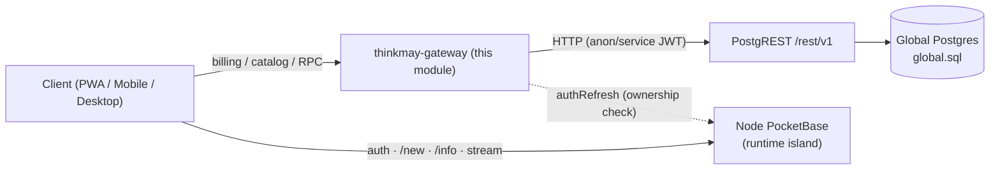
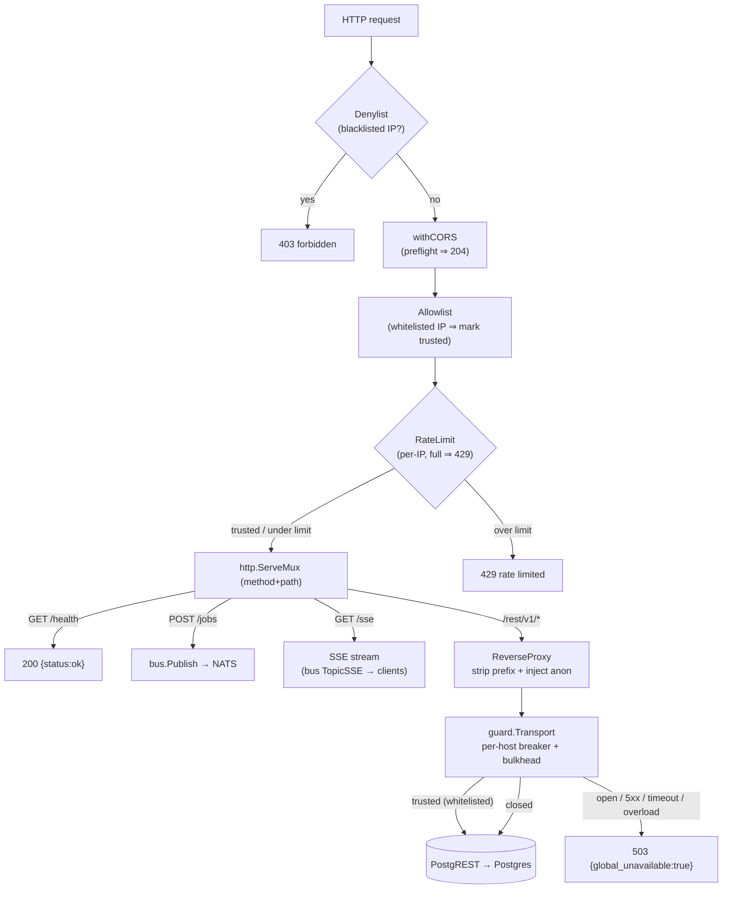
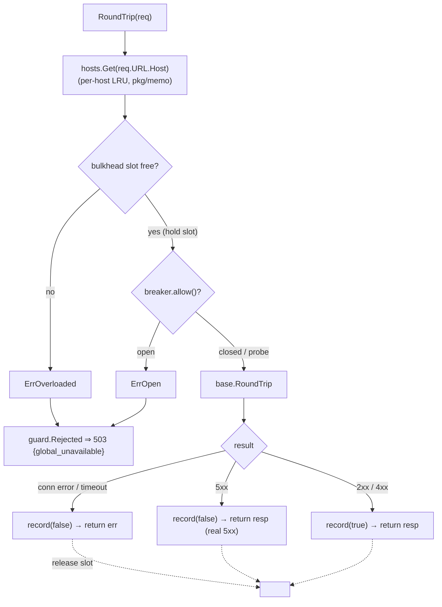
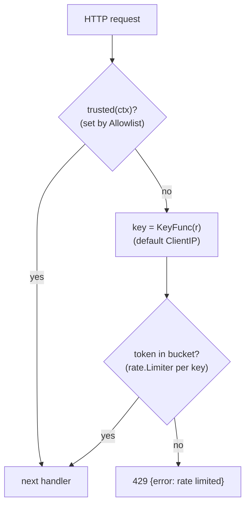
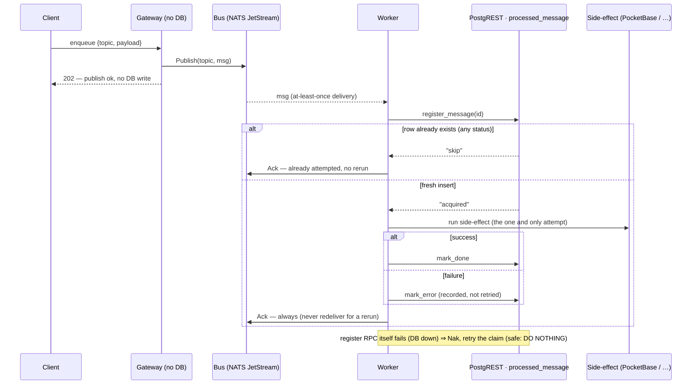
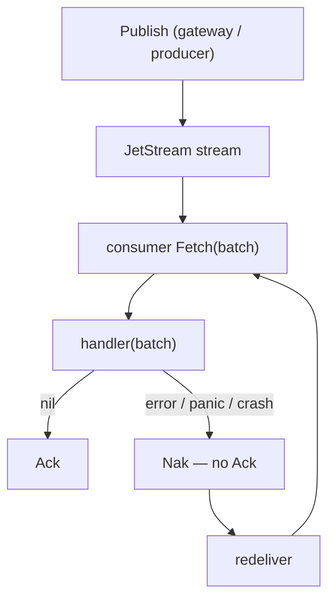

# `api/` Architecture — Thinkmay Global Control Plane

## 1. Core principle — gateway is an API-tier client, not a DB client

The most important rule for this module (TDD **P2/P3**, **F1**, checklist **P0-A**):

> The gateway **never opens its own Postgres connection**. It reaches global data
> through **PostgREST** (`/rest/v1`). Postgres credentials never leave the
> Supabase stack.



**Two planes, never coupled on the hot path (P11):**

| Plane | Owner | Reaches it via |
|-------|-------|----------------|
| **Global** — billing, catalog, jobs, files, mail | Global Postgres | this gateway → PostgREST |
| **Node runtime** — users, volumes, sessions, templates | Per-node PocketBase | client → PocketBase directly |

A global outage (this gateway / Postgres down) must **not** break node login, VM
boot, or streaming.

---

## 2. Gateway

The gateway reproduces the Supabase routing that Kong used to do, plus the
encrypted RPC the Next.js `global_rpc` **route** used to do, behind one Go process.
It is plain **`net/http`** — the `ServeMux` method+path routing added in **Go 1.22**
(`GET /jobs/{id}`, `PathValue`, wildcards); no web framework. (Module targets Go 1.26.)

### 2.0 Request flow (current)



- **Inbound guard chain** (`guard.Chain`, outermost first): **Denylist** (blacklisted IP ⇒ 403) → **CORS** (preflight) → **Allowlist** (whitelisted IP ⇒ mark `trusted` in ctx) → **RateLimit** (per-IP, over limit ⇒ 429; skips trusted). See §2.5.
- **Typed** (`POST /jobs`): `handler.Create` generates an id and `bus.Publish`es to NATS, returning `202 {id}` once JetStream acks. The gateway holds **no Postgres client** — publish only (§3.1).
- **Proxy** (`/rest/v1/*`): `httputil.ReverseProxy` strips prefix + injects anon; this is how clients read state too (e.g. job status from `processed_message`).
- **Outbound guard** — the proxy's `guard.Transport` (per-host breaker **+ bulkhead**); open / 5xx / timeout / overload ⇒ `503 {global_unavailable:true}`, never a hang. A whitelisted request carries `trusted` through the ctx and skips this too (§2.4 / §2.5 / P11).

### 2.1 `/rest/v1` transparent proxy

`httputil.ReverseProxy` to the PostgREST base URL. The director:

1. Strips the `/rest/v1` prefix.
2. Injects `apikey` + `Authorization: Bearer <anonKey>` when the client sent none
   (this is the lean replacement for Kong's `key-auth`/`acl` anon role mapping).
3. Enforces a per-request timeout (TDD §2.1.1, default **5s**).

Full Kong plugin matrix (request-transformer, basic-auth, per-path ACL) is
**out of scope** for v1 — WAF allowlist + anon role mapping only.

### 2.2 PostgREST client (`pkg/postgrest`)

The **worker** (not the gateway) calls PostgREST over HTTP rather than SQL, via
RPCs that register the message atomically:

| Op | PostgREST call |
|----|----------------|
| Register message | `POST /rpc/register_message` → `acquired` \| `skip` |
| Mark outcome | `POST /rpc/mark_done` / `POST /rpc/mark_error` |

Every call wraps `context.WithTimeout` (checklist **G2**: timeouts before
breakers) and sets `apikey` + bearer JWT. The client also exposes typed CRUD
(`Select` / `Insert` / `Update` / `Delete`), `RPC`, and `IsConflict`.

### 2.3 Outbound guard — circuit breaker + bulkhead + timeout (TDD §2.1.1)

`pkg/guard` is one `http.RoundTripper` shared by the proxy and any typed client;
each target **host** gets its own breaker + bulkhead. Three layers, all fail-fast
to `503 {"global_unavailable": true}` (never a hang; a gateway 503 must not cascade
into node `/new`, P11 / R-F4):

1. **Timeout** — at the caller (`context.WithTimeout`, 5s), not in the transport
   (avoids the defer-cancel-closes-body bug). Bounds every call.
2. **Breaker** — opens after `MaxFailures` consecutive failures (conn error,
   timeout, **5xx**); `4xx` is a client error, not a failure, so it doesn't trip.
   A 5xx is counted **and** the real response still returns to the caller. Open
   for `Cooldown`, then a half-open probe. Reactive: it cuts a *sustained*
   outage, not the first burst.
3. **Bulkhead** (`MaxConcurrent`, per host) — caps concurrent in-flight calls;
   when full it sheds immediately (`ErrOverloaded`), without queuing or counting
   against the breaker. This is what stops the **initial spike** the breaker
   misses while it's still accumulating failures behind a hung host.

`guard.Transport.RoundTrip` flow (bulkhead → breaker → downstream):



- The breaker is a small hand-rolled state machine (`allow()` / `record(success)`),
  so a 5xx is fed back via `record(false)` while the **real response returns
  unchanged** — no synthetic error to wrap and unwrap.
- `Rejected(err)` is true for **ErrOverloaded** and **ErrOpen** (the two fail-fast
  rejections) ⇒ caller returns 503. A `5xx` is **not** rejected.
- The slot is released on every path (deferred), so shedding/opening never leaks
  capacity.

> Known gap: the breaker counts *consecutive* failures, so a partial outage
> (interleaved 200/5xx) may never trip it — the bulkhead is the backstop. Switch
> to a failure-ratio over a window if that becomes real.

### 2.4 Inbound guard — rate limit + whitelist

Same `pkg/guard`, other direction. Outbound protects us from a dead **downstream**;
inbound protects us from an abusive **client**. Both share one generic per-key
cache — `memo.Cache[K,V]` (`pkg/memo`), a lazy-build LRU — outbound keys a
breaker+bulkhead by host, inbound keys a token bucket by client. The inbound side
is a `Middleware` chain (`guard.Chain`):



- **`RateLimitConfig{RPS, Burst, Key, MaxKeys}`** — `Key` picks the bucket dimension
  (IP now; API key / user later, via a `KeyFunc`); `MaxKeys` caps distinct buckets (LRU).
- **Whitelist = `Allowlist(match)`** — a matching request is marked **trusted** in
  its `context`, skipping **all** guard: the inbound rate limit *and* the outbound
  breaker/bulkhead (`Transport.RoundTrip` reads `trusted(ctx)`; the ctx flows
  inbound → proxy → RoundTrip). Trade-off: no fail-fast, but the caller timeout
  still bounds it. Use for admin / health checks that must pass even under shedding.
- **Blacklist = `Denylist(match)`** — matching request ⇒ **403** at the door
  (inbound only; a blocked client never reaches downstream, so no outbound check).
- **`IPSet("10.0.0.0/8", "1.2.3.4")`** builds the `Match` (tests `ClientIP` against
  IPs/CIDRs). Wired in `newMux`: `Chain(mux, Denylist(…), withCORS, Allowlist(…), RateLimit(…))`.
- Token bucket via `golang.org/x/time/rate`: `Burst` absorbs spikes, `RPS` is the
  sustained rate; over-limit ⇒ **429** (distinct from the outbound 503).

- **Bounded keyspace:** the per-key cache is an LRU (`memo.Cache`), capped by
  `MaxKeys` (rate buckets, default 10k) / `MaxHosts` (breakers, default 1k), so a
  flood of unique keys (spoofed IPs / attacker `Host`) evicts the least-recently-used
  instead of growing the map unbounded. Still pair with an upstream WAF/IP allowlist
  before exposing to the open internet.

### 2.6 Live events (SSE broadcast)

`GET /sse` is a server-sent-event stream. The gateway subscribes the bus topic
`TopicSSE` once (`SSEHub.Dispatch`) and fans each message out to the connected
clients it matches — `SSEMsg.Recipient` targets one user's streams, empty
broadcasts to all. Producers publish typed events to the bus from anywhere:

```go
bus.Publish(ctx, busClient, model.TopicSSE,
    model.SSEMsg{Type: model.SSENotification, Recipient: "user@x", Data: payload})
```

- **Typed kinds:** `SSEType` consts (`SSENotification`, …) + a payload struct per
  kind, so producers/consumers aren't stringly-typed.
- **Per-client fan-out:** each connection holds a buffered channel; `Dispatch`
  does a non-blocking send, so a slow client **drops** events rather than stalling
  the bus (live, best-effort). Wire format + headers per TDD §2.4.1
  (`text/event-stream`, `Cache-Control: no-store`, 25s keepalive).
- **Known gaps:** recipient comes from `?user=` (TODO: derive from auth, not the
  client); one fixed consumer group is correct for a single gateway — multi-replica
  needs a unique group per process so every replica gets a copy.

---

## 3. Async jobs — gateway → bus → worker

The gateway **publishes** to the bus and fast-returns; the worker subscribes,
registers, and executes. The full flow is **§3.1** below (this is what the code does).

- **Model** (`shared/model`): `TopicJob = bus.NewTopic[JobMsg]("jobs")` + `JobMsg` (carries the idempotency `id`);
  `TopicUsage = bus.NewTopic[UsageMsg]("usage.snapshot")` for the analytics sink;
  `TopicSSE = bus.NewTopic[SSEMsg]("sse")` for the live event stream (§2.6).
- **Bus** (`pkg/bus`): type-safe pub/sub with **per-message ack** (`Handler` returns `[]error`); `nats` (JetStream) in prod, `memory` for tests.

### 3.1 Target flow — gateway publishes, worker runs at most once

The gateway holds **no DB**: an enqueue API just **publishes** to the topic
(`jobs`, `analytics`, …) and fast-returns the moment the bus accepts the message
— it never checks a downstream result. Dedup state lives at the **worker** in one
table, `processed_message` (`pkg/idempotency`).

The worker runs each id **at most once**: `register_message` is a register-first
claim (`INSERT … ON CONFLICT DO NOTHING`) — the consume commitment. The first
delivery runs the side-effect; any later delivery (duplicate or crash redelivery)
sees the row and **skips**. The side-effect is **never retried** — chosen because
the destination cannot dedup, so a double-run is worse than a drop (§4b).



`register_message` is a single PostgREST **RPC** = one Postgres transaction; the
INSERT…ON CONFLICT is atomic, so two concurrent workers can't both acquire. The
table:

| column | role |
|--------|------|
| `id` | message id = **idempotency key** (PK) |
| `status` | `pending` / `done` / `error` — **observability only** (never gates re-run) |
| `updated_at` | last write |

- **Dedup by existence:** a fresh INSERT ⇒ `acquired` (run). Any existing row ⇒
  `skip` (Ack, no rerun) — regardless of status.
- **At most once:** the INSERT is the consume fence. Once it commits the message
  is never run again — duplicate, slow-job redelivery, or crash all skip.
- **No retry:** a side-effect failure is recorded (`mark_error`) and **Ack'd** — a
  retry would be a second attempt. Only a `register` RPC error (claim not
  committed) Naks, and re-running the claim is safe (`DO NOTHING`).

> **Trade-off (at most once, by choice).** A worker that crashes between the
> register commit and finishing the side-effect drops the message (0 runs) — the
> bus redelivers, but `register` now skips it. We accept loss over double-run
> because the destination is **not idempotent** (§4b). To instead never lose, the
> destination must dedup by message id; then flip to at-least-once (skip on `done`
> only, retry on error).

---

## 4. Worker

A thin loop: subscribe to `TopicJob` → `idem.Run(id, fn)` → the guard registers,
runs the side-effect, and records the outcome. Full flow in §3.1. The worker also
subscribes `TopicUsage` and batch-INSERTs usage into ClickHouse (`SubscribeBatch` +
`WithConcurrency(1)` for serial inserts) — the analytics sink, folded in here
rather than a separate binary.

**Idempotency** (`pkg/idempotency`): a `Guard` over a `Store` interface — backends
`PostgrestStore` (durable, prod) and `MemStore` (tests). `Guard.Run` is the
at-most-once orchestration: register → skip-or-run → `mark_done`/`mark_error`,
always Ack (only a register error Naks).

**Bus today:** `pkg/bus/nats` is **NATS JetStream** — durable pull consumers,
explicit Ack, redelivery on restart (§4b). The transport is at-least-once; the
worker turns it into **at-most-once** via register-first (§3.1). Handlers run in a
bounded pool per group (`WithConcurrency(n)`; unset = unbounded, `n=1` = serial).
(`memory` backend remains for tests.)

**State:** the worker owns one table — `processed_message` (the at-most-once
ledger) — reached over **PostgREST RPC**, no direct DB handle (P2/P3).

**Transport:** **NATS JetStream** — durable streams + replay in one light binary
(fits the single-host, solo-dev lean goal); analytics goes NATS → a Go sink →
ClickHouse (the worker's usage subscription) since CH has no native NATS engine. This supersedes
the earlier Kafka pick in `planning.md` D3.

---

## 4b. Delivery semantics — at-least-once bus, at-most-once worker

The bus **transport** is at-least-once: each message is **Ack'd only when its
verdict is nil** — `Handler` returns `[]error`, one slot per payload, so one bad
message in a batch naks **only itself**, not its neighbours. An error/panic/crash
leaves it un-acked ⇒ redelivered (no DLQ — it redelivers until its handler acks).



So the bus may **deliver** a message more than once (competing consumers, or a
crash before Ack). The **worker** makes *processing* **at most once** on top of
that: `register_message` (§3.1) is a DB-atomic `INSERT … ON CONFLICT DO NOTHING`,
so the first delivery acquires and every later one skips — no in-process mutex
(a `sync.Mutex` guards one process only, useless across competing consumers /
multi-host, TDD F3).

| Bus delivers twice because… | Worker outcome |
|------|------|
| **Concurrent** — two consumers get the same id at once | one INSERT wins (`acquired`), the other `skip`s |
| **Redelivery** — handler ran then crashed before Ack | `register` sees the row ⇒ `skip` (the side-effect is **not** re-run) |

**Why at-most-once (not idempotent-destination exactly-once).** The destination
**cannot dedup** by message id, so a double side-effect is unacceptable — worse
than a drop. The register-first claim guarantees ≤1 run; the cost is that a worker
crashing mid-side-effect drops the message (the redelivery skips), and a `pending`
row is left behind. No DLQ — a failed/lost message is simply gone. If the
destination later gains a dedup key, switch to at-least-once (skip on `done`,
retry on error) for no-loss exactly-once.

**Concurrency.** Within a group, fetched batches run in a handler pool
(`WithConcurrency(n)`; unset = a goroutine per batch, `n=1` = serial). The
semaphore also backpressures the fetch loop so the pool can't be outrun;
per-message ack/nak is unchanged.

---

## 5. Fault isolation (P11) — what this module must guarantee

| Failure | Gateway behavior | Node impact |
|---------|------------------|-------------|
| PostgREST / Postgres down | 503 `{global_unavailable:true}` on global routes | none — login/`/new`/stream keep working on node PB |
| PocketBase issuer slow on `authRefresh` | 3s timeout → encrypted RPC 503 | none |
| Worker down | jobs persist on the bus (NATS JetStream); replay on recovery | none |

The gateway is allowed to fail; it is **never** allowed to make the node plane
fail. Any gateway→PocketBase call (`authRefresh`, future grants) is guard +
timeout protected and fail-open where the node hot path depends on it.
