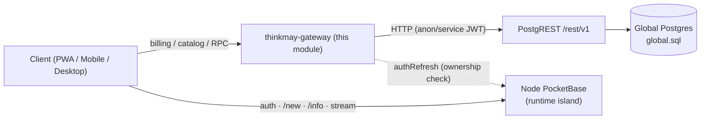
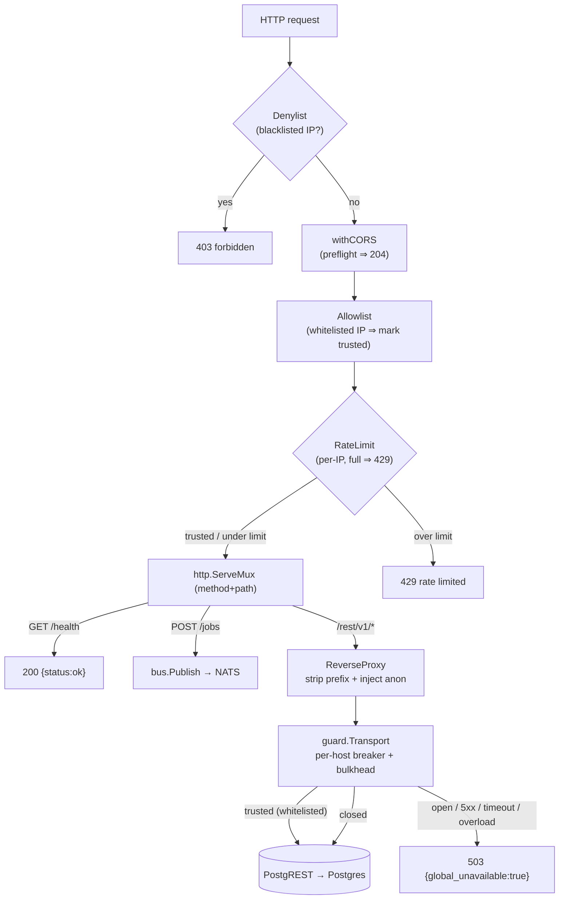
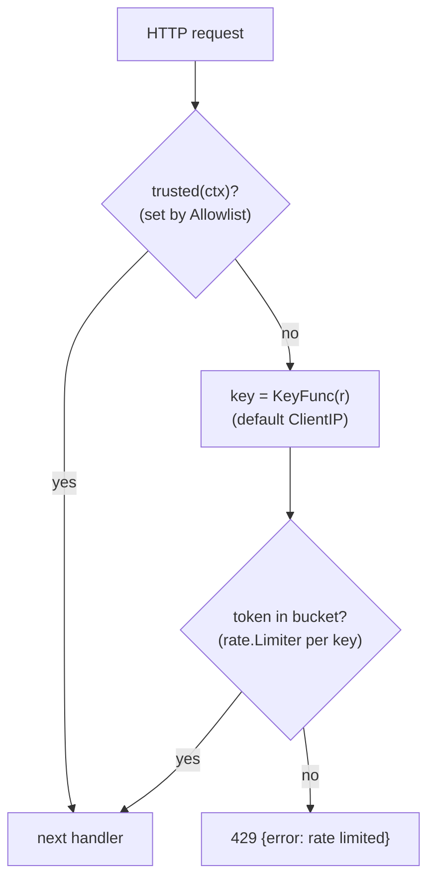
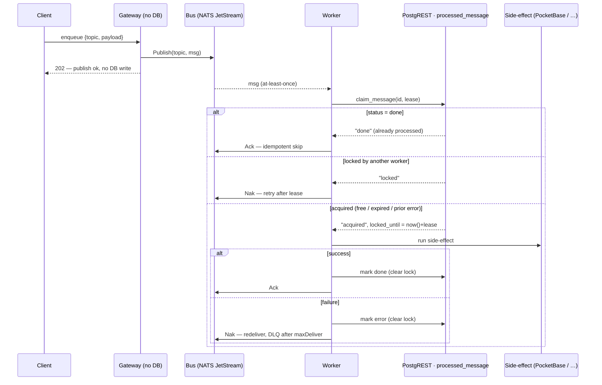
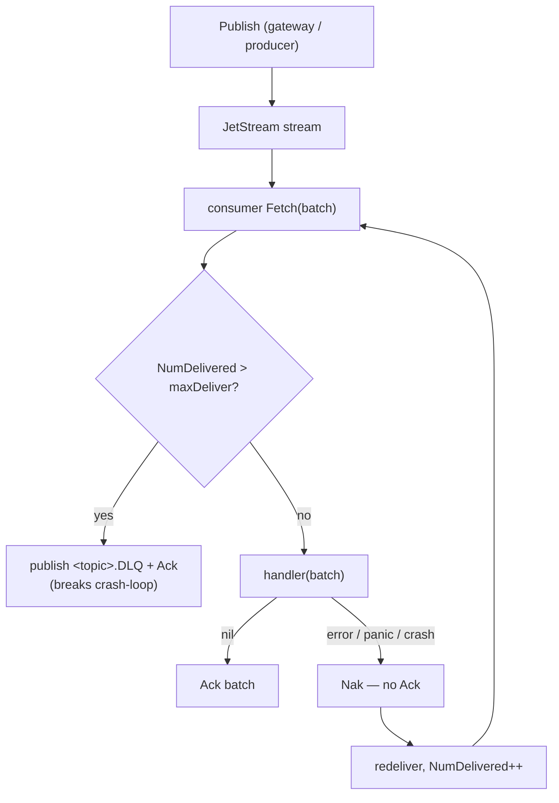
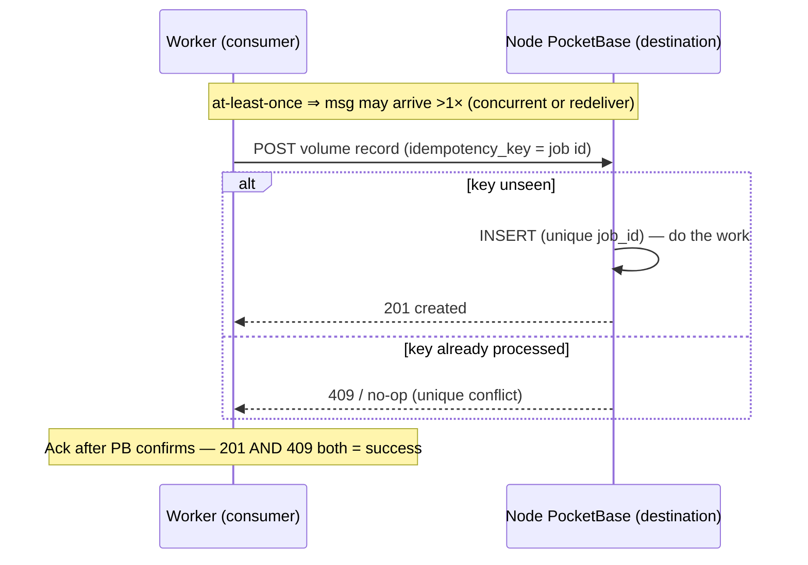

# `api/` Architecture — Thinkmay Global Control Plane

## 1. Core principle — gateway is an API-tier client, not a DB client

The most important rule for this module (TDD **P2/P3**, **F1**, checklist **P0-A**):

> The gateway **never opens its own Postgres connection**. It reaches global data
> through **PostgREST** (`/rest/v1`). Postgres credentials never leave the
> Supabase stack.

**Two planes, never coupled on the hot path (P11):**

| Plane | Owner | Reaches it via |
|-------|-------|----------------|
| **Global** — billing, catalog, jobs, files, mail | Global Postgres | this gateway → PostgREST |
| **Node runtime** — users, volumes, sessions, templates | Per-node PocketBase | client → PocketBase directly |

A global outage (this gateway / Postgres down) must **not** break node login, VM
boot, or streaming.

---

## 2. Gateway

The gateway reproduces the Supabase routing that Kong used to do, plus the
encrypted RPC the Next.js `global_rpc` **route** used to do, behind one Go process.
It is plain **`net/http`** — the `ServeMux` method+path routing added in **Go 1.22**
(`GET /jobs/{id}`, `PathValue`, wildcards); no web framework. (Module targets Go 1.26.)

### 2.0 Request flow (current)

- **Inbound guard chain** (`guard.Chain`, outermost first): **Denylist** (blacklisted IP ⇒ 403) → **CORS** (preflight) → **Allowlist** (whitelisted IP ⇒ mark `trusted` in ctx) → **RateLimit** (per-IP, over limit ⇒ 429; skips trusted). See §2.5.
- **Typed** (`POST /jobs`): `handler.Create` generates an id and `bus.Publish`es to NATS, returning `202 {id}` once JetStream acks. The gateway holds **no Postgres client** — publish only (§3.1).
- **Proxy** (`/rest/v1/*`): `httputil.ReverseProxy` strips prefix + injects anon; this is how clients read state too (e.g. job status from `processed_message`).
- **Outbound guard** — the proxy's `guard.Transport` (per-host breaker **+ bulkhead**); open / 5xx / timeout / overload ⇒ `503 {global_unavailable:true}`, never a hang. A whitelisted request carries `trusted` through the ctx and skips this too (§2.4 / §2.5 / P11).

### 2.1 `/rest/v1` transparent proxy

`httputil.ReverseProxy` to the PostgREST base URL. The director:

1. Strips the `/rest/v1` prefix.
2. Injects `apikey` + `Authorization: Bearer <anonKey>` when the client sent none
   (this is the lean replacement for Kong's `key-auth`/`acl` anon role mapping).
3. Enforces a per-request timeout (TDD §2.1.1, default **5s**).

Full Kong plugin matrix (request-transformer, basic-auth, per-path ACL) is
**out of scope** for v1 — WAF allowlist + anon role mapping only.

### 2.2 PostgREST client (`pkg/postgrest`)

The **worker** (not the gateway) calls PostgREST over HTTP rather than SQL, via
RPCs that keep the claim atomic:

| Op | PostgREST call |
|----|----------------|
| Claim message | `POST /rpc/claim_message` → `acquired` \| `done` \| `locked` |
| Mark outcome | `POST /rpc/mark_done` / `POST /rpc/mark_error` |

Every call wraps `context.WithTimeout` (checklist **G2**: timeouts before
breakers) and sets `apikey` + bearer JWT. The client also exposes `RPC` and
`IsConflict`.

### 2.3 Outbound guard — circuit breaker + bulkhead + timeout (TDD §2.1.1)

`pkg/guard` is one `http.RoundTripper` shared by the proxy and any typed client;
each target **host** gets its own breaker + bulkhead. Three layers, all fail-fast
to `503 {"global_unavailable": true}` (never a hang; a gateway 503 must not cascade
into node `/new`, P11 / R-F4):

1. **Timeout** — at the caller (`context.WithTimeout`, 5s), not in the transport
   (avoids the defer-cancel-closes-body bug). Bounds every call.
2. **Breaker** — opens after `MaxFailures` consecutive failures (conn error,
   timeout, **5xx**); `4xx` is a client error, not a failure, so it doesn't trip.
   A 5xx is counted **and** the real response still returns to the caller. Open
   for `Cooldown`, then a half-open probe. Reactive: it cuts a *sustained*
   outage, not the first burst.
3. **Bulkhead** (`MaxConcurrent`, per host) — caps concurrent in-flight calls;
   when full it sheds immediately (`ErrOverloaded`), without queuing or counting
   against the breaker. This is what stops the **initial spike** the breaker
   misses while it's still accumulating failures behind a hung host.

`guard.Transport.RoundTrip` flow (bulkhead → breaker → downstream):

- The breaker is a small hand-rolled state machine (`allow()` / `record(success)`),
  so a 5xx is fed back via `record(false)` while the **real response returns
  unchanged** — no synthetic error to wrap and unwrap.
- `Rejected(err)` is true for **ErrOverloaded** and **ErrOpen** (the two fail-fast
  rejections) ⇒ caller returns 503. A `5xx` is **not** rejected.
- The slot is released on every path (deferred), so shedding/opening never leaks
  capacity.

> Known gap: the breaker counts *consecutive* failures, so a partial outage
> (interleaved 200/5xx) may never trip it — the bulkhead is the backstop. Switch
> to a failure-ratio over a window if that becomes real.

### 2.4 Inbound guard — rate limit + whitelist

Same `pkg/guard`, other direction. Outbound protects us from a dead **downstream**;
inbound protects us from an abusive **client**. Both share one generic per-key
`registry[T]` — outbound keys a breaker+bulkhead by host, inbound keys a token
bucket by client. The inbound side is a `Middleware` chain (`guard.Chain`):

- **`RateLimitConfig{RPS, Burst, Key}`** — `Key` picks the bucket dimension (IP now;
  API key / user later, via a `KeyFunc`).
- **Whitelist = `Allowlist(match)`** — a matching request is marked **trusted** in
  its `context`, skipping **all** guard: the inbound rate limit *and* the outbound
  breaker/bulkhead (`Transport.RoundTrip` reads `trusted(ctx)`; the ctx flows
  inbound → proxy → RoundTrip). Trade-off: no fail-fast, but the caller timeout
  still bounds it. Use for admin / health checks that must pass even under shedding.
- **Blacklist = `Denylist(match)`** — matching request ⇒ **403** at the door
  (inbound only; a blocked client never reaches downstream, so no outbound check).
- **`IPSet("10.0.0.0/8", "1.2.3.4")`** builds the `Match` (tests `ClientIP` against
  IPs/CIDRs). Wired in `newMux`: `Chain(mux, Denylist(…), withCORS, Allowlist(…), RateLimit(…))`.
- Token bucket via `golang.org/x/time/rate`: `Burst` absorbs spikes, `RPS` is the
  sustained rate; over-limit ⇒ **429** (distinct from the outbound 503).

> Known gap: the per-key registry never evicts, so a flood of unique client keys
> (spoofed IPs) grows the map unbounded — itself a DoS vector. Add TTL/LRU eviction
> (or an upstream WAF/IP allowlist) before exposing this to the open internet.

---

## 3. Async jobs — gateway → bus → worker

The gateway **publishes** to the bus and fast-returns; the worker subscribes,
claims, and executes. The full flow is **§3.1** below (this is what the code does).

- **Model** (`shared/model`): `TopicJob = bus.NewTopic[JobMsg]("jobs")` + `JobMsg` (carries the idempotency `id`);
  `TopicUsage = bus.NewTopic[UsageEvent]("usage.snapshot")` for the analytics sink.
- **Bus** (`pkg/bus`): type-safe pub/sub with **per-message ack** (`Handler` returns `[]error`); `nats` (JetStream) in prod, `memory`/`redis` for tests.

### 3.1 Target flow — gateway publishes, worker owns dedup + lock

The gateway holds **no DB**: an enqueue API just **publishes** to the topic
(`jobs`, `analytics`, …) and fast-returns the moment the bus accepts the message
— it never checks a downstream result. All durable state lives at the **worker**,
in one table that merges the idempotency ledger and the processing lock:
`processed_message`.

`claim_message` is a single PostgREST **RPC** = one Postgres transaction, so the
idempotency check and the lock acquire are atomic — there is no window where two
workers both "see free, then both lock". The merged table:

| column | role |
|--------|------|
| `id` | message id = **idempotency key** (PK) |
| `status` | `pending` / `done` / `error` |
| `locked_until` | **lease**; `< now()` = free (a dead worker auto-releases) |
| `attempts` | claim / redelivery count |

- **Idempotency:** `status = done` ⇒ skip (Ack). `error` or absent ⇒ run the side-effect.
- **Lock:** `locked_until` blocks a second worker until the lease expires. A worker
  that dies mid-process never unlocks explicitly — the lease lapses and the next
  delivery re-acquires. Postgres has no row TTL; the lease column **is** the TTL,
  checked lazily at claim time — no reaper job.

> **Residual at-least-once gap (by design, not a bug).** The lock kills
> *concurrent* doubles and `done` skips *redelivered* ones — but if a worker
> finishes the side-effect and crashes **before** `mark done`, the lease lapses
> and the side-effect re-runs. Closing that last window needs either an
> **idempotent side-effect** (destination unique key, §4b) or folding the
> side-effect + `mark done` into one transaction (impossible across an HTTP
> destination). So `processed_message` is the **claim-then-do** primary; a
> dedup-capable destination is the belt-and-suspenders.

---

## 4. Worker

A thin loop: subscribe to `TopicJob` → `claim_message` (idempotency + lock) → run
the side-effect → `mark_done` / `mark_error`. Full flow in §3.1.

**Bus today:** `pkg/bus/nats` is **NATS JetStream** — durable pull consumers,
explicit Ack, redelivery on restart, **DLQ + max-deliver** (§4b). At-least-once,
**not** fire-and-forget. (`redis` Streams + `memory` backends remain for
tests / as options.)

**State:** the worker owns one table — `processed_message`, merging the
idempotency ledger and the processing lock — reached over **PostgREST RPC**, no
direct DB handle (P2/P3). The old `job` / `outbox` / `processed_jobs` tables are
gone.

**OPEN — transport (Kafka vs NATS JetStream).** `planning.md` D3 / checklist Q1
say **Kafka**; the code currently uses **NATS JetStream**. JetStream gives durable
streams + replay + DLQ in one light binary (fits the single-host, solo-dev lean
goal), and analytics goes NATS → a Go sink → ClickHouse (`cmd/usagesink`) since CH
has no native NATS engine. This **contradicts a resolved D-decision** and must be
reconciled in `planning.md` before adoption, not chosen silently here.

---

## 4b. Delivery semantics — at-least-once, DLQ, idempotency

The bus is **NATS JetStream** (`pkg/bus/nats`). Delivery contract across every
backend: each message is **Ack'd only when its verdict is nil** — `Handler`
returns `[]error`, one slot per payload, so one poison message in a batch naks
**only itself**, not its neighbours ⇒ **at-least-once**. An error/panic/crash
leaves it un-acked ⇒ redelivered. After `maxDeliver` attempts it is parked in
`<topic>.DLQ` so a poison message can't crash-loop the consumer forever.

**Two ways the same message gets processed twice** (both inherent to
at-least-once — not bugs to remove):

| Root | Cause |
|------|-------|
| **Concurrent** | two consumers (competing group / multi-instance) get the same key at once |
| **Sequential** | handler did the work, then crashed/closed **before** Ack ⇒ redelivered on restart |

**Both are solved by a DB-atomic claim, not by an in-process mutex** (a
`sync.Mutex` only guards one process — useless across competing consumers /
multi-host, TDD F3). The primary mechanism is the worker's **`processed_message`
claim** (§3.1): `claim_message` is one transaction, so check-idempotency +
acquire-lock can't race. A dedup-capable **destination** (below) closes the
remaining "side-effect done, crash before `mark_done`" window.

> Why also destination-side: the consumer dispatches the side-effect over **HTTP**,
> not inside the `processed_message` transaction — so it can't fold the dedup row
> and the side-effect into one tx. The worker claim is **claim-then-do** (acquire
> → work → `mark_done`); if it crashes between work and `mark_done`, the lease
> lapses and the work re-runs. A unique key at the destination makes that re-run a
> no-op — belt-and-suspenders for true exactly-once.

**DLQ knobs** (`pkg/bus/nats`): `WithMaxDeliver(n)` (default 5; `n<=0` = unlimited).
Poison → `<topic>.DLQ`. `bus.Attempt(ctx)` exposes the redelivery count to a
handler. Covered by `TestNats_PoisonMessageGoesToDLQ` (real JetStream container).

---

## 5. Fault isolation (P11) — what this module must guarantee

| Failure | Gateway behavior | Node impact |
|---------|------------------|-------------|
| PostgREST / Postgres down | 503 `{global_unavailable:true}` on global routes | none — login/`/new`/stream keep working on node PB |
| PocketBase issuer slow on `authRefresh` | 3s timeout → encrypted RPC 503 | none |
| Worker down | jobs persist on the bus (NATS JetStream); replay on recovery | none |

The gateway is allowed to fail; it is **never** allowed to make the node plane
fail. Any gateway→PocketBase call (`authRefresh`, future grants) is guard +
timeout protected and fail-open where the node hot path depends on it.
