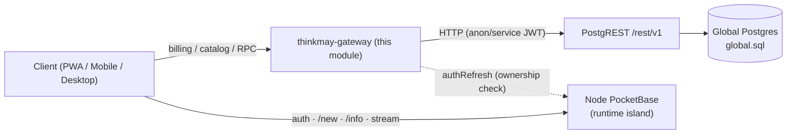
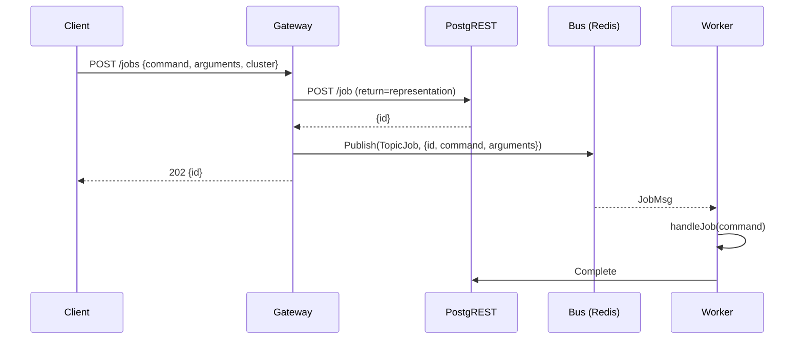

# `api/` Architecture — Thinkmay Global Control Plane

> **Source of truth:** product/migration truth lives in
> [`docs/projects/db-migration/tdd.md`](../docs/projects/db-migration/tdd.md)
> (target architecture), [`planning.md`](../docs/projects/db-migration/planning.md)
> (decisions D1–D12), and [`execution-checklist.md`](../docs/projects/db-migration/execution-checklist.md)
> (phased tasks). **This file describes how the `api/` Go module implements that
> truth.** On any conflict, the db-migration docs win.

This module is the **`thinkmay-gateway`** (TDD module 1) plus its async
**worker**. It is the single external API edge for the *global plane* (billing,
catalog, jobs, files, mail) — it is **not** the node runtime plane (that stays on
per-node PocketBase).

---

## 1. Core principle — gateway is an API-tier client, not a DB client

The most important rule for this module (TDD **P2/P3**, **F1**, checklist **P0-A**):

> The gateway **never opens its own Postgres connection**. It reaches global data
> through **PostgREST** (`/rest/v1`). Postgres credentials never leave the
> Supabase stack.



**Two planes, never coupled on the hot path (P11):**

| Plane | Owner | Reaches it via |
|-------|-------|----------------|
| **Global** — billing, catalog, jobs, files, mail | Global Postgres | this gateway → PostgREST |
| **Node runtime** — users, volumes, sessions, templates | Per-node PocketBase | client → PocketBase directly |

A global outage (this gateway / Postgres down) must **not** break node login, VM
boot, or streaming.

---

## 2. Module layout

```
api/
  gateway/            external API edge (HTTP server)
    main.go           entrypoint -> Run()
    app.go            wiring: config -> postgrest client -> echo -> serve
    echo.go           Echo instance + route registration
    proxy.go          /rest/v1/* transparent proxy -> PostgREST   (P0-A)
    handler/          typed JSON handlers (/jobs, future /v1/...)
    repo/             data access — PostgREST-backed 
  worker/             async bus consumer (job execution)
    main.go           subscribe -> run -> record
    route.go          bus subscription wiring
    job.go            command handlers
  contract/           shared types + bus topics (gateway <-> worker)
  config/             viper config loader (config.yaml + APP_* env)
  pkg/                reusable building blocks
    bus/              type-safe pub/sub (redis | memory)
    postgrest/        PostgREST HTTP client
    pg/               pgx pool + custom types (worker only)
    validator/        go-playground validator wrapper
    errors/           coded errors (HTTP status + Restate-safe)
  docs/               knowledge base (product truth, migration project, specs)
  doc/                this file
```

> **Status note:** the gateway no longer opens a Postgres pool — `gateway/app.go`
> builds a `pkg/postgrest` client and `gateway/repo` calls PostgREST over HTTP.
> Design: [`docs/superpowers/specs/2026-06-17-gateway-postgrest-design.md`](../docs/superpowers/specs/2026-06-17-gateway-postgrest-design.md).
> The **worker** still uses `pkg/pg` — but whether it *should* hold a direct DB
> connection is **OPEN** (see §5), not a settled decision.

---

## 3. Gateway

The gateway reproduces the Supabase routing that Kong used to do, plus the
encrypted RPC the Next.js `global_rpc` route used to do, behind one Go process.

### 3.1 Route map (target, TDD §2.1.1)

| Path | Backend | Auth | Status |
|------|---------|------|--------|
| `GET /health` | self | none | ✅ implemented |
| `/rest/v1/*` | PostgREST (proxy) | anon JWT injected if absent; else forward client JWT | ✅ implemented |
| `POST /jobs`, `GET /jobs/:id` | PostgREST via repo | service/anon JWT | ✅ implemented |
| `/api/global_rpc/` | gateway handler | PocketBase `authRefresh` | 🔜 P0-A (R4 legacy compat) |
| `/v1/...` | typed handlers | per route | 🔜 future |
| `/storage/v1/*`, `/functions/v1/*` | Storage API / Edge runtime (proxy) | forward | 🔜 |
| `/v1/search/stores` | Elasticsearch | anon | DEFER (Phase 2) |

**Removed from target:** `/realtime/v1` (D10) and `/auth/v1` / GoTrue (D1 — login
is PocketBase only). PostgREST uses a static **anon JWT** for public catalog reads,
not a GoTrue user session.

### 3.2 `/rest/v1` transparent proxy

`httputil.ReverseProxy` to the PostgREST base URL. The director:

1. Strips the `/rest/v1` prefix.
2. Injects `apikey` + `Authorization: Bearer <anonKey>` when the client sent none
   (this is the lean replacement for Kong's `key-auth`/`acl` anon role mapping).
3. Enforces a per-request timeout (TDD §2.1.1, default **5s**).

Full Kong plugin matrix (request-transformer, basic-auth, per-path ACL) is
**out of scope** for v1 — WAF allowlist + anon role mapping only.

### 3.3 PostgREST client (`pkg/postgrest`)

The typed handlers (e.g. `/jobs`) call PostgREST over HTTP rather than SQL:

| Op | PostgREST call |
|----|----------------|
| Enqueue job | `POST /job` with `Prefer: return=representation` → read back `id` |
| Get job | `GET /job?id=eq.{id}&limit=1` → empty array means 404 |

Every call wraps `context.WithTimeout` (checklist **G2**: timeouts before
breakers) and sets `apikey` + bearer JWT.

### 3.4 Circuit breaker + timeout invariant (TDD §2.1.1)

Every outbound call (PostgREST, PocketBase `authRefresh`, payment providers,
Elasticsearch) uses **both** an explicit per-request timeout **and** (where
flapping is observed) a circuit breaker. On open/timeout the gateway returns
`503 {"global_unavailable": true}` — it never hangs, and a gateway 503 must never
cascade into node `/new` (P11 / R-F4).

---

## 4. Async jobs — gateway → bus → worker

Current flow (in code today): the gateway enqueues a job row and publishes a
message on the typed event bus; the worker subscribes and executes.



- **Contract** (`contract/job.go`): `TopicJob = bus.NewTopic[JobMsg]("jobs")`,
  plus `JobMsg` (queue payload) and `Job` (status row).
- **Bus** (`pkg/bus`): type-safe pub/sub; `redis` in prod, `memory` for tests.

> **Target (checklist P0-B, not yet built):** replace the bus enqueue + single
> `job` table with a **transactional outbox** in Postgres + a **Kafka** relay and
> idempotent consumers. The `contract` + `worker` shapes are the seam where that
> swap lands. Until then, the bus path stays.

---

## 5. Worker

A thin loop: subscribe to `TopicJob` on the bus → run the command handler →
record the outcome.

**Bus today:** `pkg/bus/redis` is **Redis Streams** — consumer groups, `XACK`,
pending-list replay on restart, `MAXLEN ~100k`. At-least-once, **not**
fire-and-forget pub/sub.

**OPEN — job-result writeback (undecided; CEO/architect call).** The migration
docs do **not** sanction the worker holding a direct Postgres connection. The
post-migration consumer pattern they describe is **bus-in → node PocketBase
HTTP-out** (tdd.md F02 / P6 / lines 185, 220, 800), with Postgres writes happening
via the **transactional outbox in the originating transaction** (checklist P0-B) —
not via the consumer writing back. The current `Complete` (`UPDATE job` over pgx
in `worker/repo`) is the **legacy single-job-table pattern that P0-B replaces**;
it is kept only until the writeback mechanism is decided. Candidate mechanisms:
outbox/event, PostgREST, or a gateway RPC.

> Do **not** treat "worker connects to Postgres directly" as approved — it is an
> interim holdover pending the P0-B decision, not a documented design.

**OPEN — transport (Kafka vs Redis Streams).** `planning.md` D3 / checklist Q1
say **Kafka**; the code currently uses **Redis Streams**. Because the outbox is
the durability authority, a non-durable bus + an always-on outbox poller
(`dispatched_at IS NULL`) + idempotent consumers is a defensible lighter design
for jobs/payments — but it **contradicts a resolved D-decision** and must be
reconciled in `planning.md` before adoption, not chosen silently here.

---

## 6. Configuration

Loaded by viper: `config/config.yaml` is the base, overridden by `APP_*` env
vars, then validated (missing/invalid = hard error). Env key = `APP_` + upper
snake path, e.g. `APP_POSTGREST_URL`, `APP_REDIS_ADDR`.

```yaml
port: "4000"
log:        { level: debug, format: json, addSource: true }
redis:      { addr: localhost:6379 }

# Gateway: how to reach the global plane (NOT a direct DB connection)
postgrest:
  url: http://localhost:3000
  anonKey: "<anon JWT>"        # public catalog reads / proxy default
  serviceKey: "<service JWT>"  # privileged writes (reserved)

# Worker only — direct DB until outbox/Kafka lands
postgres:   { host: localhost, port: 5432, username: ..., password: ..., database: ..., sslmode: disable }
```

Secrets stay in `.env` / env, **never committed** (D6).

---

## 7. Fault isolation (P11) — what this module must guarantee

| Failure | Gateway behavior | Node impact |
|---------|------------------|-------------|
| PostgREST / Postgres down | 503 `{global_unavailable:true}` on global routes | none — login/`/new`/stream keep working on node PB |
| PocketBase issuer slow on `authRefresh` | 3s timeout → encrypted RPC 503 | none |
| Worker down | jobs queue on bus / (future) Kafka; replay on recovery | none |

The gateway is allowed to fail; it is **never** allowed to make the node plane
fail. Any gateway→PocketBase call (`authRefresh`, future grants) is breaker +
timeout guarded and fail-open where the node hot path depends on it.

---

## 8. Testing

| Layer | Approach |
|-------|----------|
| `pkg/postgrest` | table-driven unit tests vs `httptest.Server` (insert→id, empty→404, timeout→error) |
| `/rest/v1` proxy | `httptest`: prefix strip + anon header injection + client-JWT passthrough |
| `pkg/bus` | conformance suite shared across redis/memory backends |
| Gateway contract | **Supabase SDK contract tests are mandatory before any Kong cutover** (R3) |

---

## 9. What this module is NOT

- Not the node runtime DB (that is per-node PocketBase: users, volumes, sessions,
  templates — TDD §2.3).
- Not GoTrue / `/auth/v1`, not Supabase Realtime (both removed — D1, D10).
- Not a billing engine that reads ClickHouse/Rybbit — billing math stays in
  Postgres only (P5).
- Not a human CMS for `stores` — catalog writes come through the MCP server (D9).
